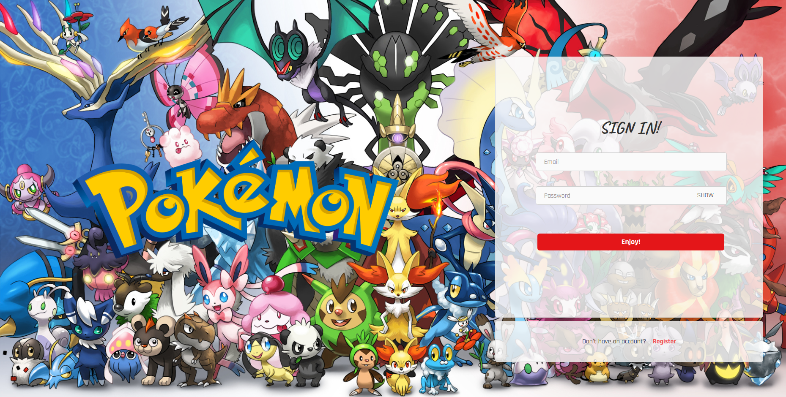
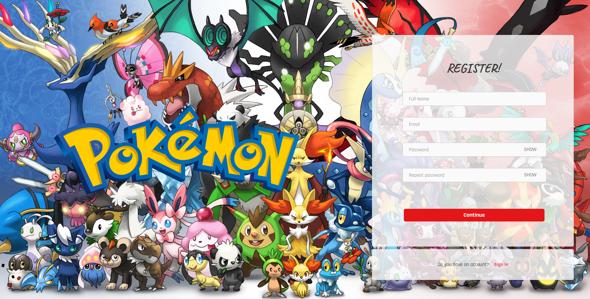
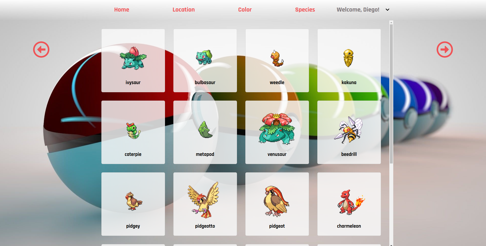
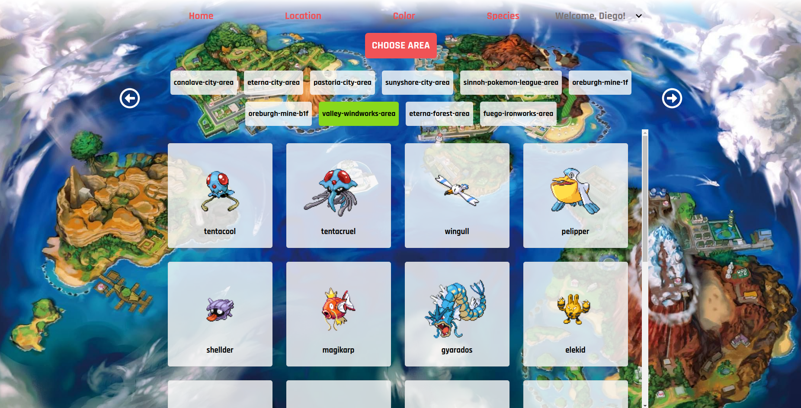
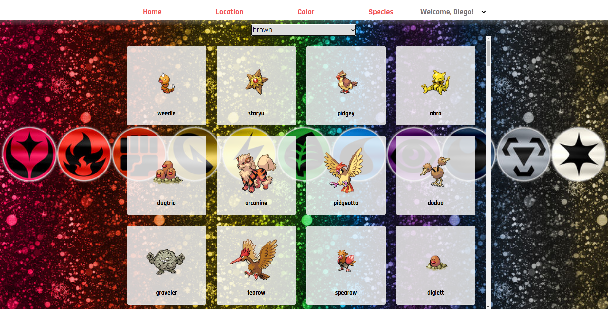
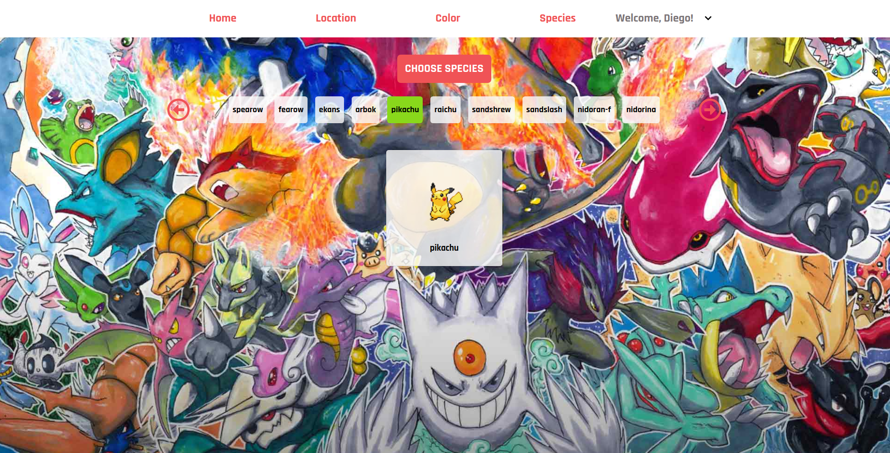
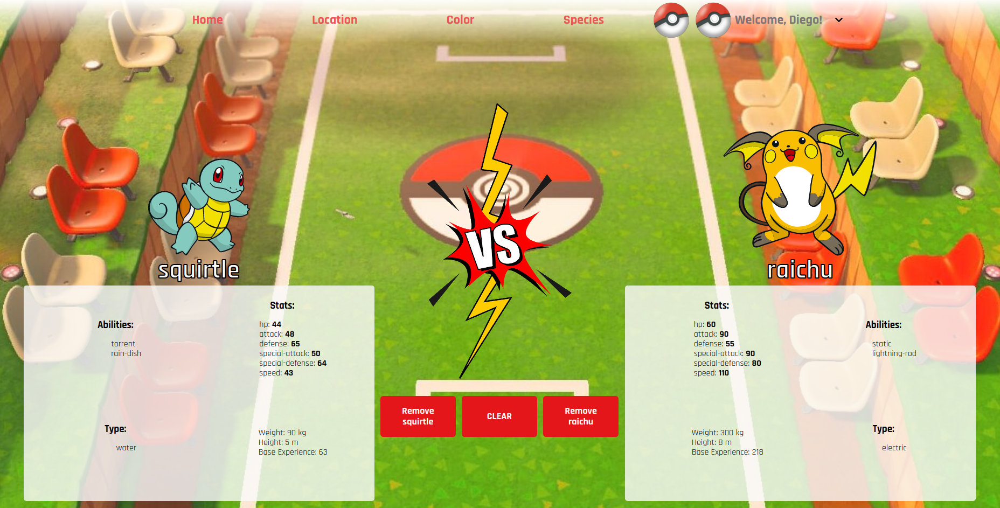

<!-- PROJECT LOGO -->
<br />
<p align="center">
    
</p>


<!-- TABLE OF CONTENTS -->
<details open="open">
  <summary>Table of Contents</summary>
  <ol>
    <li>
      <a href="#about-the-project">About The Project</a>
    </li>
    <li>
      <a href="#installation">Installation</a>
    </li>
    <li>
      <a href="#app-overview">App Overview</a>
    </li>
    <li><a href="#languages-and-tools">Languages and Tools</a></li>
    <li><a href="#license">License</a></li>
    <li><a href="#contact">Contact</a></li>
  </ol>
</details>


<!-- ABOUT THE PROJECT -->
## About The Project

This project was <b>started the 6th May and finished the 10th May 2021</b>.

Pokedex is a Frontend web application that allows users to login and search for pokemons. In this application, the users will be able to filter the pokemons by location, color and species. On top of this, they will be able to choose 2 pokemons in order to compare the stats and abilities for battle.

I have added a small backend built with [Nodejs](https://nodejs.org/), [Sequelize](https://sequelize.org/) and [MySQL](https://www.mysql.com/) database. All data fetching was done using [Express](https://expressjs.com/) and [Axios](https://github.com/axios/axios) for declaring JSON structures.

The front end was created with [Reactjs](https://es.reactjs.org/) and [JavaScript](https://developer.mozilla.org/es/docs/Web/JavaScript) and uses the [Redux](https://es.redux.js.org/) architectural framework for an optimal single-page user-experience.


#### Authentication page
Back-end and front-end user authentication was built from scratch by encrypting user password with [Bcryptjs](https://www.npmjs.com/package/bcryptjs) and creating a unique session token with [JSONWebToken](https://www.npmjs.com/package/jsonwebtoken) for each user on sign up or login. This allows for secure access to one's account on the single-page application.

#### Expra features and improvements added:

- Small backend that is able to register, log in and index users.
- Register and Login with full user validation.
- All the features like the modal or the dropdown menu are made entirely by myself. Not external libraries used at all.
- Redux LocalStorage Simple is used for data persistence .
- Docker-compose to initialize the backend
- Create React Native App

## Installation

For the <b>Frontend</b> you will need to follow the bellow instructions

Access the frontend directory.

```sh
cd frontend/
```

Install the dependencies and devDependencies for the frontend repository.

```sh
npm i
```
In the project directory, you can run:

```sh
npm start
```
And if you wish, you can run the scss

```sh
npm run scss
```

----

For the <b>Backend</b> you will need to follow the bellow instructions

Access the backend directory.

```sh
cd backend/
```

Install the dependencies and devDependencies for the frontend repository.

```sh
npm i
```
Run the docker-compose.yml with:

```sh
docker-compose up
```
Create the DB and do all the migrations.You will need to do this only the first time as Docker-compose will create a volume which will give you data persistence:

```sh
sequelize db:create

sequelize db:migrate
```
Now start the server
```sh
npm run start
```

<!-- USAGE -->
## APP OVERVIEW

#### Registration & Login



<br>
<br>



<br>
<br>

#### Pokedex


###### Home view



<br>
<br>

###### Location view



<br>
<br>

###### Color view



<br>
<br>

###### Species view



<br>
<br>

###### Battle view



<br>
<br>


---


<!-- ACKNOWLEDGEMENTS -->
## Languages and Tools:
<p align="left">
    <a href="https://www.w3schools.com/css/" target="_blank"> 
        
    </a> 
    <a href="https://sass-lang.com/" target="_blank"> 
        
    </a> 
    <a href="https://expressjs.com" target="_blank"> 
        
    </a>
    <a href="https://git-scm.com/" target="_blank">
        
    </a>
    <a href="https://www.w3.org/html/" target="_blank">
        
    </a>
    <a href="https://developer.mozilla.org/en-US/docs/Web/JavaScript" target="_blank">
        
    </a>
    <a href="https://www.mongodb.com/" target="_blank"> 
        
    </a>
    <a href="https://nodejs.org" target="_blank">
         
    </a>
    <a href="https://postman.com" target="_blank">
        
    </a>
    <a href="https://reactjs.org/" target="_blank">
        
    </a>
    <a>
        
    </a>
    <a>
        
    </a>
    <a>
        
    </a>
</p>


<!-- LICENSE -->
## License

Distributed under the MIT License. See `LICENSE` for more information.

<!-- CONTACT -->
## Contact

- Diego García 
    - [GitHub](https://github.com/diegogb-08)
    - [LinkedIn](https://www.linkedin.com/in/diego-garcia-brisa/)